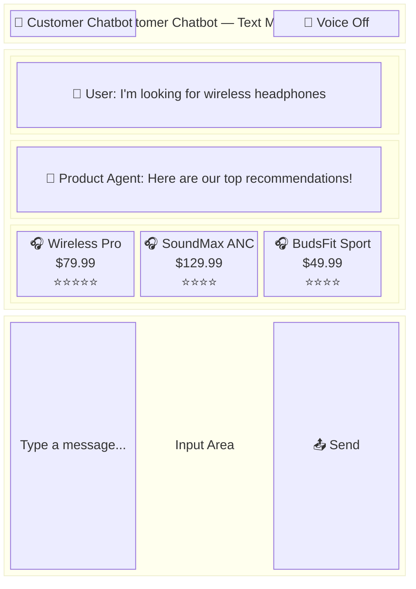
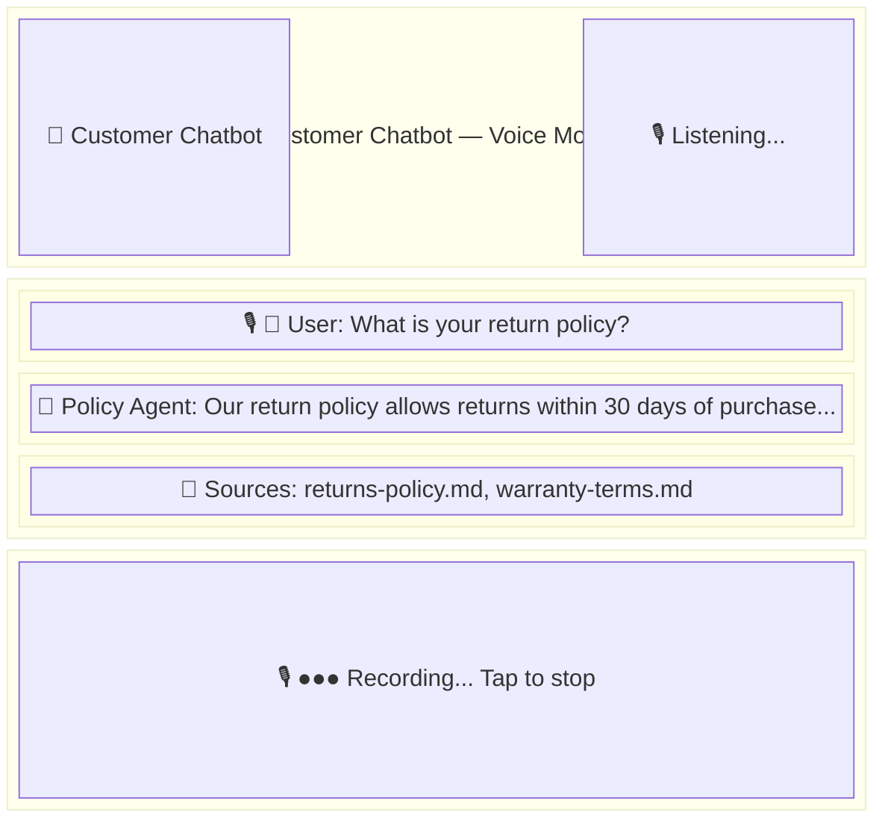
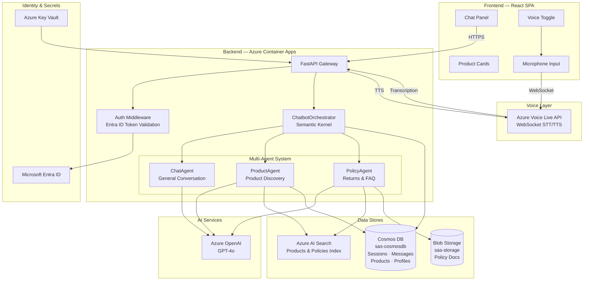
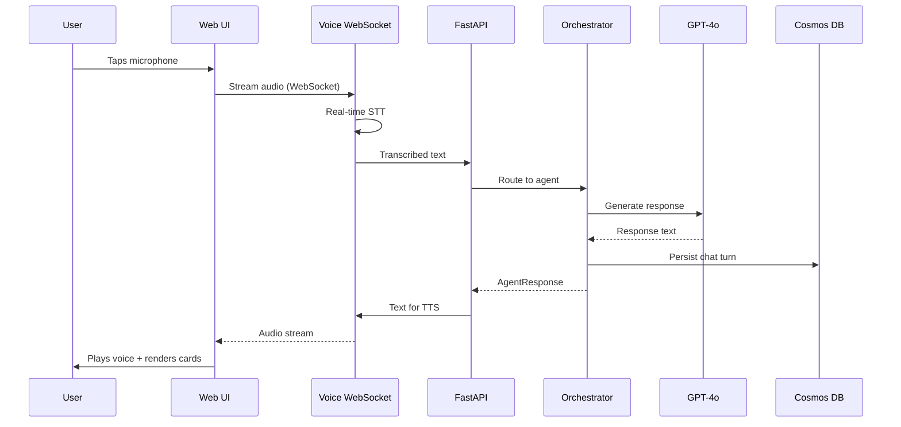
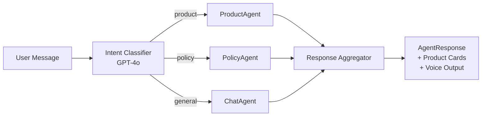

# Customer Chatbot GSA with Voice

A multi-agent conversational AI chatbot supporting both text and voice modalities for product
discovery, customer support, and policy queries. Built with **FastAPI** + **Semantic Kernel** on
the backend, **React + TypeScript** on the frontend, and deployed to **Azure Container Apps**
with Microsoft Entra ID authentication.

<br/>

<div align="center">

[**SOLUTION OVERVIEW**](#solution-overview) \| [**QUICK DEPLOY**](#quick-deploy) \| [**LOCAL DEVELOPMENT**](#local-development) \| [**TESTING**](#testing) \| [**SUPPORTING DOCUMENTATION**](#supporting-documentation)

</div>

<br/>

> **Note:** This project follows the [SDL with GitHub Copilot and Azure](/.github/SDL-with-Copilot-and-Azure.md)
> lifecycle. See [AGENTS.md](/AGENTS.md) for AI-assisted development guidance.

> **Responsible AI:** With any AI solutions you create, you are responsible for assessing all
> associated risks and for complying with all applicable laws and safety standards.
> Learn more in the [Transparency FAQ](./TRANSPARENCY_FAQ.md).

<br/>

---

## Solution Overview

The Customer Chatbot GSA with Voice is a conversational AI accelerator that routes user queries
through specialized agents — **Chat**, **Product**, and **Policy** — orchestrated by
Semantic Kernel and powered by Azure OpenAI GPT-4o. Voice interaction is provided via
Azure Voice Live API with real-time speech-to-text and text-to-speech over WebSocket.
The system consists of two containerized services (API + Web) running on Azure Container Apps.

### Web UI Preview

#### Chat Interface — Text Mode

<!-- Replace with actual screenshot: docs/images/readme/chat-text-mode.png -->



#### Chat Interface — Voice Mode

<!-- Replace with actual screenshot: docs/images/readme/chat-voice-mode.png -->



> **Note:** The wireframes above illustrate the UI layout. Replace with actual screenshots after deployment
> by adding images to `docs/images/readme/` and updating the image references above.

### Solution Architecture



### Voice Interaction Flow



### Multi-Agent Routing



### Key Features

<details open>
  <summary>Click to learn more about the key features</summary>

  - **Multi-agent orchestration** <br/>
    Intent-based routing to Chat, Product, and Policy agents via Semantic Kernel.

  - **Voice interaction** <br/>
    Real-time speech-to-text and text-to-speech via Azure Voice Live API over WebSocket.

  - **Product discovery** <br/>
    Product search and recommendations with visual product cards rendered in the UI.

  - **Policy & FAQ support** <br/>
    RAG-powered policy retrieval from Blob Storage and Azure AI Search.

  - **Session management** <br/>
    Per-user chat history persisted in Cosmos DB with session lifecycle management.

  - **Multi-language support** <br/>
    Configurable per-locale voice and LLM prompts (v1 scope).

  - **Secure authentication** <br/>
    Microsoft Entra ID via MSAL.js (frontend) + bearer token validation (backend).

</details>

### Tech Stack

| Layer            | Technology                                           |
| ---------------- | ---------------------------------------------------- |
| Backend          | Python 3.12+ / FastAPI / Uvicorn                     |
| Frontend         | React 18 / TypeScript / Vite                         |
| AI Orchestration | Semantic Kernel + Azure AI Foundry                   |
| LLM              | Azure OpenAI GPT-4o                                  |
| Voice            | Azure Voice Live API (WebSocket STT/TTS)             |
| Package Mgmt     | UV (Python) / npm (TypeScript)                       |
| Data Access      | `sas-cosmosdb` (PyPI) — Cosmos DB Repository Pattern |
| Blob Storage     | `sas-storage` (PyPI) — Azure Blob operations         |
| Search           | Azure AI Search                                      |
| Authentication   | Microsoft Entra ID / MSAL.js                         |
| Containerization | Docker                                               |
| Hosting          | Azure Container Apps                                 |
| Infrastructure   | Bicep                                                |
| Deployment       | Azure Developer CLI (`azd`)                          |

### API Endpoints

| Method   | Path                             | Description           | Auth         |
| -------- | -------------------------------- | --------------------- | ------------ |
| `POST`   | `/api/chat/message`              | Send text message     | Bearer token |
| `POST`   | `/api/chat/session`              | Create chat session   | Bearer token |
| `GET`    | `/api/chat/session/{id}/history` | Get chat history      | Bearer token |
| `DELETE` | `/api/chat/session/{id}`         | End/archive session   | Bearer token |
| `WS`     | `/api/voice/stream`              | Voice audio streaming | Token in msg |
| `GET`    | `/api/products/{id}`             | Get product details   | None         |
| `GET`    | `/api/health`                    | Liveness probe        | None         |
| `GET`    | `/api/ready`                     | Readiness probe       | None         |

See [docs/api/chatbot-api.md](/docs/api/chatbot-api.md) for full API documentation.

---

## Quick Deploy

### Prerequisites

- [Azure subscription](https://azure.microsoft.com/free/) with permissions to create resource groups and resources
- [Azure Developer CLI (azd)](https://learn.microsoft.com/en-us/azure/developer/azure-developer-cli/install-azd) v1.18.0+
- [Azure CLI (az)](https://learn.microsoft.com/cli/azure/install-azure-cli)
- [Python 3.12+](https://www.python.org/downloads/)
- [UV package manager](https://docs.astral.sh/uv/)
- [Node.js 20 LTS+](https://nodejs.org/)
- [Docker](https://www.docker.com/get-started/)
- [Git 2.40+](https://git-scm.com/downloads)

### Deploy with Azure Developer CLI

```bash
# 1. Clone the repository
git clone <REPO_URL>
cd customer-chatbot-gsa

# 2. Login to Azure
azd auth login

# 3. Provision infrastructure and deploy both services
azd up
```

The `azd up` command provisions all Azure resources and deploys both the API and Web containers.

> ⚠️ **Check Azure OpenAI Quota:** Ensure sufficient GPT-4o quota is available in your subscription
> before deployment.

> ⚠️ **Check Azure Speech Services Quota:** Speech Services (S0 tier) must be available in your
> target region. Some regions have limited capacity for Cognitive Services resources.

### Azure Resources Provisioned

| Resource                  | Purpose                                      |
| ------------------------- | -------------------------------------------- |
| Azure Container Apps Env  | Shared hosting environment for both services |
| Azure Container Apps (x2) | API and Web application containers           |
| Azure Container Registry  | Docker image registry                        |
| Azure Cosmos DB           | Chat sessions, messages, products, profiles  |
| Azure Blob Storage        | Policy documents and product images          |
| Azure OpenAI              | GPT-4o model deployment                      |
| Azure Speech Services     | Real-time speech-to-text and text-to-speech  |
| Azure AI Search           | Product and policy knowledge index           |
| Azure Key Vault           | Secrets management                           |
| Azure Log Analytics       | Centralized logging and monitoring           |

### Infrastructure

Infrastructure is defined in Bicep under `infra/`:

```
infra/
├── main.bicep                    # Main deployment orchestration
├── abbreviations.json            # Azure resource abbreviations
└── modules/
    ├── ai-search.bicep           # Azure AI Search service
    ├── container-apps-env.bicep  # Container Apps environment
    ├── container-registry.bicep  # ACR instance
    ├── cosmos-db.bicep           # Cosmos DB account + database
    ├── key-vault.bicep           # Key Vault
    ├── log-analytics.bicep       # Log Analytics workspace
    ├── openai.bicep              # Azure OpenAI account
    ├── speech-services.bicep     # Azure Speech Services
    └── storage.bicep             # Storage account
```

### Costs

Pricing varies per region and usage. Use the [Azure Pricing Calculator](https://azure.microsoft.com/en-us/pricing/calculator)
to estimate costs for your subscription.

| Product                                                                       | Description            | Pricing                                                                                   |
| ----------------------------------------------------------------------------- | ---------------------- | ----------------------------------------------------------------------------------------- |
| [Azure OpenAI Service](https://learn.microsoft.com/azure/ai-services/openai/) | GPT-4o model inference | [Pricing](https://azure.microsoft.com/pricing/details/cognitive-services/openai-service/) |
| [Azure Container Apps](https://learn.microsoft.com/azure/container-apps/)     | Application hosting    | [Pricing](https://azure.microsoft.com/pricing/details/container-apps/)                    |
| [Azure Cosmos DB](https://learn.microsoft.com/azure/cosmos-db/)               | Chat & product data    | [Pricing](https://azure.microsoft.com/pricing/details/cosmos-db/)                         |
| [Azure Blob Storage](https://learn.microsoft.com/azure/storage/blobs/)        | Policy docs & images   | [Pricing](https://azure.microsoft.com/pricing/details/storage/blobs/)                     |
| [Azure AI Search](https://learn.microsoft.com/azure/search/)                  | Knowledge index        | [Pricing](https://azure.microsoft.com/pricing/details/search/)                            |
| [Azure Key Vault](https://learn.microsoft.com/azure/key-vault/)               | Secrets management     | [Pricing](https://azure.microsoft.com/pricing/details/key-vault/)                         |

> ⚠️ **Important:** To avoid unnecessary costs, remember to tear down your deployment when no longer in use:
> `azd down`

---

## Local Development

### API (Python / FastAPI)

```bash
cd src/CustomerChatbotAPI

# Install dependencies
uv sync

# Install dev dependencies
uv sync --group dev

# Copy environment config
cp .env.example .env
# Edit .env with your Azure resource values

# Run locally with hot reload
uv run uvicorn app.main:app --reload --port 8000
```

Once running, the interactive API docs are available at http://localhost:8000/docs.

### Web App (React / TypeScript)

```bash
cd src/CustomerChatbotWeb

# Install dependencies
npm install

# Copy environment config
cp .env .env.local
# Edit .env.local with your Azure AD app registration values

# Run development server (proxies /api to localhost:8000)
npm run dev
```

The dev server starts at http://localhost:5173.

---

## Project Structure

```
.
├── README.md                              # This file
├── AGENTS.md                              # AI-assisted development guidance
├── azure.yaml                             # Azure Developer CLI configuration
├── .design/                               # SDL design templates (ADR, API doc, README)
├── docs/
│   ├── adr/                               # Architecture Decision Records
│   │   └── ADR-0002-customer-chatbot-voice-architecture.md
│   ├── api/                               # API documentation
│   │   └── chatbot-api.md
│   └── design/                            # Design documents
│       └── customer-chatbot-voice-design.md
├── infra/                                 # Bicep infrastructure-as-code
│   ├── main.bicep
│   ├── abbreviations.json
│   └── modules/
│       ├── ai-search.bicep
│       ├── container-apps-env.bicep
│       ├── container-registry.bicep
│       ├── cosmos-db.bicep
│       ├── key-vault.bicep
│       ├── log-analytics.bicep
│       ├── openai.bicep
│       └── storage.bicep
├── src/
│   ├── CustomerChatbotAPI/                # Python FastAPI backend
│   │   ├── Dockerfile
│   │   ├── pyproject.toml
│   │   ├── app/
│   │   │   ├── main.py                    # FastAPI entry point + lifespan
│   │   │   ├── application.py             # Settings (pydantic-settings)
│   │   │   ├── agents/                    # AI agent definitions
│   │   │   │   ├── chat_agent.py          # General conversation agent
│   │   │   │   ├── product_agent.py       # Product discovery agent
│   │   │   │   └── policy_agent.py        # Policy/FAQ agent
│   │   │   ├── domain/                    # Domain models
│   │   │   │   ├── entities.py            # Cosmos DB entities (sas-cosmosdb)
│   │   │   │   ├── enums.py               # Intent, Modality, VoiceMode enums
│   │   │   │   └── models.py              # Pydantic request/response models
│   │   │   ├── infrastructure/            # Data access layer
│   │   │   │   ├── repositories.py        # Cosmos DB repositories
│   │   │   │   └── auth_middleware.py      # Entra ID token validation
│   │   │   ├── services/                  # Business logic
│   │   │   │   ├── chatbot_orchestrator.py # Multi-agent routing + context
│   │   │   │   ├── voice_service.py       # Azure Voice Live API integration
│   │   │   │   ├── product_service.py     # Product catalog + AI Search
│   │   │   │   └── policy_service.py      # Policy docs + AI Search
│   │   │   └── routers/                   # API route handlers
│   │   │       ├── chat_router.py         # Chat message + session endpoints
│   │   │       ├── voice_router.py        # WebSocket voice streaming
│   │   │       ├── product_router.py      # Product detail endpoint
│   │   │       └── http_probes.py         # Health/readiness probes
│   │   └── tests/
│   │       ├── unit/                      # 63 unit tests (pytest)
│   │       └── integration/               # Integration tests
│   └── CustomerChatbotWeb/                # React TypeScript frontend
│       ├── Dockerfile
│       ├── package.json
│       ├── vite.config.ts
│       ├── vitest.config.ts
│       ├── src/
│       │   ├── App.tsx                    # Root component with auth gate
│       │   ├── main.tsx                   # Entry point with MSAL provider
│       │   ├── Components/
│       │   │   ├── ChatPanel.tsx          # Main chat UI
│       │   │   ├── MessageBubble.tsx      # Individual message display
│       │   │   ├── ProductCard.tsx        # Product card from agent responses
│       │   │   └── VoiceToggle.tsx        # Voice mode toggle button
│       │   ├── Hooks/
│       │   │   ├── useAuth.ts             # MSAL authentication hook
│       │   │   ├── useChat.ts             # Chat session & messaging hook
│       │   │   └── useVoice.ts            # Voice streaming hook
│       │   ├── Services/
│       │   │   ├── chatApi.ts             # REST API client for chat
│       │   │   └── voiceApi.ts            # WebSocket client for voice
│       │   ├── msal-auth/                 # MSAL configuration
│       │   └── types/                     # Shared TypeScript types
│       └── tests/
│           └── setup.ts                   # Vitest setup (31 tests)
└── .github/                               # SDL config, prompts, agents, quality instructions
```

---

## Testing

### API Tests (pytest)

```bash
cd src/CustomerChatbotAPI

# Run all tests (63 tests)
uv run pytest

# Run with coverage report
uv run pytest --cov=app --cov-report=term-missing

# Run only unit tests
uv run pytest tests/unit/

# Run only integration tests
uv run pytest tests/integration/
```

### Web App Tests (Vitest)

```bash
cd src/CustomerChatbotWeb

# Run all tests (31 tests)
npm test

# Run with coverage
npm run test:coverage
```

### Linting

```bash
# API — Type checking
cd src/CustomerChatbotAPI
uv run mypy app/

# Web — ESLint
cd src/CustomerChatbotWeb
npm run lint
```

---

## Supporting Documentation

### Architecture Decisions

| ADR                                                                  | Title                                           | Status   |
| -------------------------------------------------------------------- | ----------------------------------------------- | -------- |
| [ADR-0002](docs/adr/ADR-0002-customer-chatbot-voice-architecture.md) | Multi-Agent Architecture with Voice Integration | Proposed |

### Design Documents

| Document                                                                      | Description                                                 |
| ----------------------------------------------------------------------------- | ----------------------------------------------------------- |
| [Customer Chatbot Voice Design](docs/design/customer-chatbot-voice-design.md) | Full design doc — agents, voice, data model, Azure services |
| [API Documentation](docs/api/chatbot-api.md)                                  | REST + WebSocket endpoint reference                         |

### Development Resources

| Resource                                                | Description                      |
| ------------------------------------------------------- | -------------------------------- |
| [SDL Lifecycle](/.github/SDL-with-Copilot-and-Azure.md) | 9-phase development lifecycle    |
| [Reference Catalog](/.github/reference-catalog.md)      | Reusable libraries and templates |
| [AGENTS.md](/AGENTS.md)                                 | AI-assisted development guidance |
| [API README](src/CustomerChatbotAPI/README.md)          | Backend service details          |
| [Web README](src/CustomerChatbotWeb/README.md)          | Frontend app details             |

### Security

- Authentication via [Microsoft Entra ID](https://learn.microsoft.com/entra/identity/) with
  MSAL.js (frontend) and bearer token validation (backend).
- Secrets managed via Azure Key Vault (production) and `.env` files (local development).
- All data access uses `sas-cosmosdb` and `sas-storage` abstractions — no raw Azure SDK clients.
- Voice audio streams are transient (not persisted); only transcribed text is stored.
- Azure OpenAI content safety filters enabled on all model deployments.

---

## Contributing

1. Follow the [SDL lifecycle](/.github/SDL-with-Copilot-and-Azure.md) for all changes.
2. Create or update ADRs in `docs/adr/` for significant architectural decisions.
3. Write tests alongside all new code.
4. Use the quality instruction files that auto-apply when editing matching file types.
5. Submit PRs using the [pull request template](/.github/PULL_REQUEST_TEMPLATE.md).

---

## Responsible AI Transparency FAQ

Please refer to [Transparency FAQ](./TRANSPARENCY_FAQ.md) for responsible AI transparency details.

---

## Disclaimers

This release is an artificial intelligence (AI) system that generates text based on user input.
The text generated by this system may include ungrounded content, meaning that it is not verified
by any reliable source or based on any factual data. The data included in this release is synthetic,
meaning that it is artificially created by the system and may contain factual errors or inconsistencies.
Users of this release are responsible for determining the accuracy, validity, and suitability of any
content generated by the system for their intended purposes.

This release only supports English language input and output unless otherwise specified.

This release does not reflect the opinions, views, or values of Microsoft Corporation or any of its
affiliates, subsidiaries, or partners. Microsoft disclaims any liability or responsibility for any
damages, losses, or harms arising from the use of this release or its output.

This Software requires the use of third-party components which are governed by separate proprietary or
open-source licenses as identified below, and you must comply with the terms of each applicable license.
You must also comply with all domestic and international export laws and regulations that apply to the
Software.
