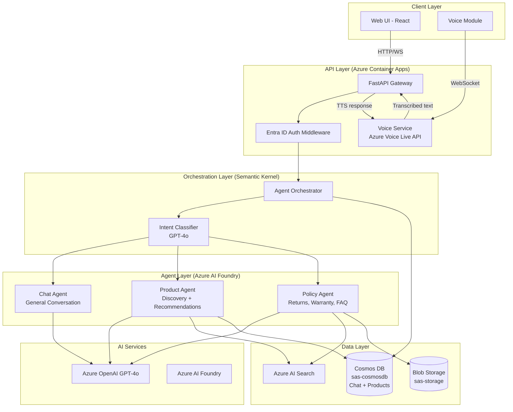

# ADR-0002: Multi-Agent Architecture with Voice Integration for Customer Chatbot GSA

> **Status:** Proposed
> **SDL Phase:** 1-2 (Requirements & Design)
> **Date:** 2026-03-16
> **Author:** @Sassy → Analyst agent

---

## Context

The team is building the **Customer Chatbot GSA with Voice**, a conversational AI accelerator
that supports both text and voice modalities. The solution must handle product discovery,
customer support, and policy queries through specialized agents, while integrating real-time
voice input/output via Azure Voice Live API.

This ADR captures the architectural decision to use a **multi-agent orchestration pattern**
with **Azure AI Foundry + Semantic Kernel** and the decision to integrate **Azure Voice Live API**
as the voice modality layer.

## Problem / Requirements

### Functional Requirements

- Support both text and voice input/output in a unified conversational interface.
- Route user queries to domain-specific agents (product, policy, general chat).
- Display visual product cards with images, pricing, and descriptions.
- Maintain per-user chat history across sessions.
- Authenticate users via Microsoft Entra ID.
- Allow users to toggle voice mode on/off.
- Provide step-by-step guidance for returns, warranties, and FAQs.
- Support responsive web/mobile UI.

### Non-Functional Requirements

- Voice transcription latency < 2 seconds for 95th percentile.
- Agent response time < 3 seconds end-to-end (text mode).
- 99.9% availability for text mode; voice mode degrades gracefully.
- Support 100+ concurrent users (initial scale target).
- Comply with Microsoft Responsible AI Standard.
- All data encrypted at rest and in transit.

### Constraints

- Must use Azure services (no third-party cloud providers).
- Must use `sas-cosmosdb` for Cosmos DB access (reference catalog mandate).
- Must use `sas-storage` for blob storage (reference catalog mandate).
- Scaffold from `python_agent_framework_dev_template` for the agent backend.
- Voice features must be independently toggleable (feature flag).
- Multi-language support in v1 — Voice Live API language models and GPT-4o system prompts must be configurable per locale.

## Design / Implementation

### Architecture

The system follows a **multi-agent orchestration** pattern where a central orchestrator
classifies user intent and routes to specialized agents. Voice is an **additive layer** —
the system is fully functional in text-only mode.

### Decision 1: Multi-Agent Architecture with Semantic Kernel + Azure AI Foundry

**Chosen approach:** Three specialized agents (Chat, Product, Policy) orchestrated via
Semantic Kernel's planner/router with Azure AI Foundry for agent hosting and lifecycle
management. Uses the GroupChat orchestrator pattern from `python_agent_framework_dev_template`.

**Rationale:**
- **Domain separation**: Each agent has focused system prompts and tools, improving response
  quality and reducing hallucination risk.
- **Proven pattern**: The `python_agent_framework_dev_template` includes a production-tested
  GroupChat orchestrator with tool sharing, middleware, and concurrent execution support.
- **Extensibility**: New agents (e.g., Order Agent, Analytics Agent) can be added without
  modifying existing ones.
- **Semantic Kernel**: Provides native Azure OpenAI integration, plugin system for tools,
  and planner capabilities for complex multi-step reasoning.

### Decision 2: Azure Voice Live API for Voice Integration

**Chosen approach:** Azure Voice Live API for real-time bidirectional voice communication
over WebSocket, with voice as an optional additive layer.

**Rationale:**
- **Real-time streaming**: WebSocket-based audio streaming provides low-latency voice
  interaction without full request/response cycles.
- **Azure-native**: Stays within the Azure ecosystem, leveraging managed infrastructure
  and compliance certifications.
- **Modality independence**: Voice is processed at the gateway layer — agents receive
  text regardless of input modality, simplifying the agent layer.
- **Graceful degradation**: If Voice Live API is unavailable, the system continues
  functioning in text-only mode.

### Azure Services

| Service              | Library                   | Purpose                                                                      |
| -------------------- | ------------------------- | ---------------------------------------------------------------------------- |
| Cosmos DB            | `sas-cosmosdb`            | Chat sessions, messages, user profiles, product catalog (Repository Pattern) |
| Blob Storage         | `sas-storage`             | Policy documents, product images                                             |
| Azure OpenAI         | `openai` (Azure endpoint) | GPT-4o for all agent reasoning                                               |
| Azure AI Foundry     | `azure-ai-projects`       | Agent hosting and lifecycle                                                  |
| Azure AI Search      | `azure-search-documents`  | RAG index over products + policies                                           |
| Azure Voice Live API | Azure Voice Live SDK      | Real-time STT/TTS                                                            |
| Azure Container Apps | AVM module                | Backend + frontend hosting (containerized)                                   |
| Microsoft Entra ID   | `msal` / `azure-identity` | Authentication (OAuth 2.0 / OIDC)                                            |
| Azure Key Vault      | `azure-keyvault-secrets`  | Secrets management                                                           |

### Data Model

**Cosmos DB containers** (via `sas-cosmosdb` Repository Pattern):

| Container       | Entity        | Partition Key | Purpose                       |
| --------------- | ------------- | ------------- | ----------------------------- |
| `chat-sessions` | `ChatSession` | `/user_id`    | Session metadata and state    |
| `chat-messages` | `ChatMessage` | `/session_id` | Individual conversation turns |
| `user-profiles` | `UserProfile` | `/id`         | User preferences and metadata |

| `products` | `Product` | `/category` | Product catalog |

**Blob Storage containers** (via `sas-storage`):

| Container        | Purpose                                           |
| ---------------- | ------------------------------------------------- |
| `policies`       | Company policy documents (returns, warranty, FAQ) |
| `product-images` | Product images for card rendering                 |

### API Endpoints

| Method | Path                             | Description                               |
| ------ | -------------------------------- | ----------------------------------------- |
| POST   | `/api/chat/message`              | Send text message, receive agent response |
| POST   | `/api/chat/session`              | Create new chat session                   |
| GET    | `/api/chat/session/{id}/history` | Get chat history for session              |
| DELETE | `/api/chat/session/{id}`         | End/archive a chat session                |
| WS     | `/api/voice/stream`              | WebSocket for voice audio streaming       |
| GET    | `/api/products/{id}`             | Get product details for card rendering    |
| GET    | `/api/health`                    | Health probe                              |
| GET    | `/api/ready`                     | Readiness probe                           |

## Alternatives Considered

### Alternative 1: Single Monolithic Agent

- **Pros:** Simpler architecture; single system prompt; no routing overhead.
- **Cons:** System prompt becomes unwieldy; response quality degrades as domain grows;
  harder to test individual capabilities; no isolation between concerns.
- **Rejected because:** Multi-agent approach is proven in the reference template, provides
  better response quality through domain focus, and allows independent scaling and testing.

### Alternative 2: Azure Communication Services for Voice

- **Pros:** Mature telephony integration; PSTN support.
- **Cons:** Heavier infrastructure; telephony features not needed; higher latency for
  browser-based voice; more complex integration.
- **Rejected because:** Azure Voice Live API is purpose-built for real-time browser/app
  voice interactions. ACS is better suited for call-center scenarios with PSTN requirements.

### Alternative 3: Separate Backend per Agent (Microservices)

- **Pros:** True independence; agents can scale separately; polyglot-friendly.
- **Cons:** Significant operational overhead; network latency between services; complex
  deployment; overkill for 3 agents.
- **Rejected because:** The GroupChat orchestrator pattern in a single backend provides
  sufficient isolation with far less operational complexity. Can be revisited if agent
  count exceeds 5-6.

### Alternative 4: Azure Bot Service for Orchestration

- **Pros:** Built-in channel support; adaptive cards.
- **Cons:** Less flexible than Semantic Kernel for custom orchestration; tied to Bot
  Framework patterns; harder to integrate with Azure AI Foundry.
- **Rejected because:** Semantic Kernel provides more flexible multi-agent orchestration
  and aligns with the AI Foundry integration direction.

## Testing Strategy

- **Unit tests:** Test each agent independently with mocked AI responses; test intent
  classifier accuracy; test data model validation via `sas-cosmosdb` entities.
- **Integration tests:** Test full orchestration flow (message → intent → agent → response);
  test Cosmos DB CRUD via `sas-cosmosdb` repositories; test API endpoints via httpx.
- **Voice integration tests:** Test STT→Agent→TTS pipeline with recorded audio samples;
  test fallback behavior when Voice Live API is unavailable.
- **E2E tests:** Playwright tests for critical user journeys (sign in, text chat, voice
  chat, product card display, policy lookup).
- **RAI tests:** Adversarial prompt injection tests; content safety filter validation;
  bias testing on product recommendations.
- **Manual testing:** Voice quality assessment; conversational flow testing with personas
  (Bruno, Cecil Lima).

## RAI / Risk Considerations

- [x] Prompt injection risks assessed — input sanitization for both text and transcribed voice.
- [x] Data privacy impact reviewed — audio is transient; only transcripts stored.
- [x] Bias considerations documented — product recommendation auditing planned.
- [ ] Content safety filters tested with adversarial inputs (Phase 6).
- [ ] Voice consent UX reviewed by design team (Phase 6).
- [ ] Accessibility audit (WCAG 2.1 AA) completed (Phase 6).

## SDL Impact by Phase

| Phase                      | Impact                                                                                           |
| -------------------------- | ------------------------------------------------------------------------------------------------ |
| 1-2: Requirements & Design | This ADR + Design Document                                                                       |
| 3: Repo Structure & CI/CD  | Scaffold from `python_agent_framework_dev_template`; add React frontend; configure ADO pipelines |
| 4: Implementation & Tests  | Implement agents, voice service, frontend; write unit + integration tests                        |
| 5: Documentation           | API docs, ADR updates, README, deployment guide                                                  |
| 6: QA Activities           | RAI testing, voice quality testing, accessibility audit, security review                         |
| 7: RAI Review              | Full RAI assessment for voice + generative AI combination                                        |
| 8-9: Release & Publish     | Release script, PR review, publish to GitHub and Seismic                                         |

## Open Questions

- [ ] **Azure Voice Live API maturity**: Is Voice Live API GA or preview? What SLA applies?
- [ ] **Data retention**: What TTL should chat history have in Cosmos DB?
- [ ] **Concurrent user target**: What scale should the initial deployment support?
- [x] ~~**Product data source**: Is there an existing product catalog, or does it need to be created?~~ **Decided:** Design from scratch in Cosmos DB (`products` container).
- [x] ~~**Frontend integration**: Standalone SPA or embedded in existing Customer Feedback web app?~~ **Decided:** Standalone React SPA. Customer Feedback app is deprecated.
- [ ] **Voice language support**: When is multi-language voice planned (v2 timeline)?
- [x] ~~**Deployment model**: Azure App Service vs. Azure Container Apps?~~ **Decided:** Azure Container Apps.
- [x] ~~**Compliance**: Which compliance frameworks apply (GDPR, SOC 2)?~~ **Decided:** None required at this time.

## References

- [python_agent_framework_dev_template](https://github.com/mcaps-microsoft/python_agent_framework_dev_template) — Scaffolding template
- [sas-cosmosdb](https://github.com/mcaps-microsoft/python_cosmosdb_helper) — Cosmos DB Repository Pattern
- [sas-storage](https://github.com/mcaps-microsoft/python_storageaccount_helper) — Blob/Queue storage
- [Azure Voice Live API](https://learn.microsoft.com/azure/ai-services/speech-service/) — Voice integration
- [Semantic Kernel](https://learn.microsoft.com/semantic-kernel/) — Agent orchestration
- [Azure AI Foundry](https://learn.microsoft.com/azure/ai-studio/) — Agent hosting
