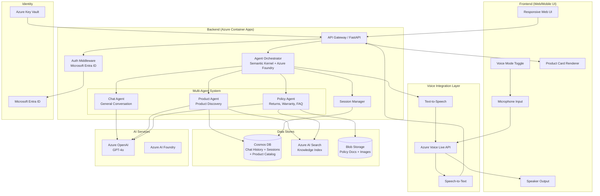
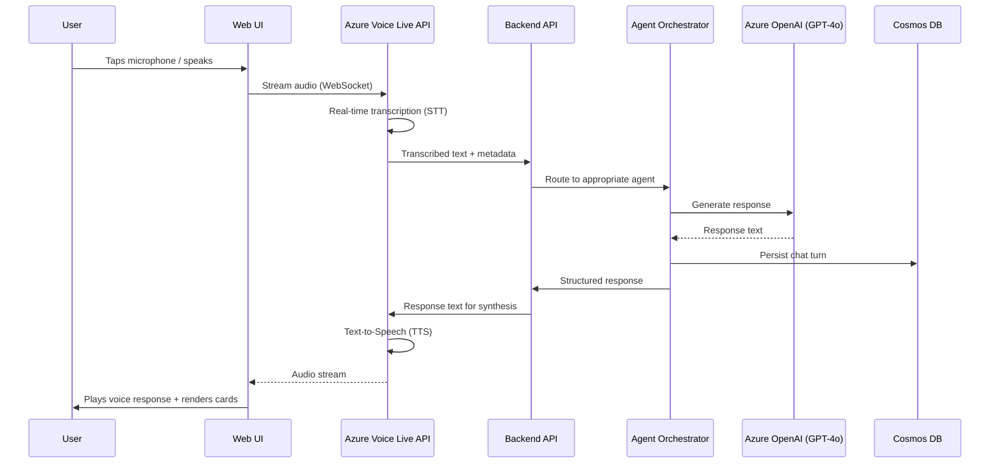
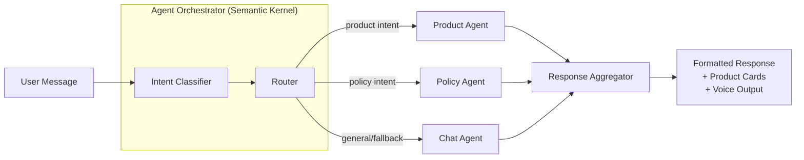
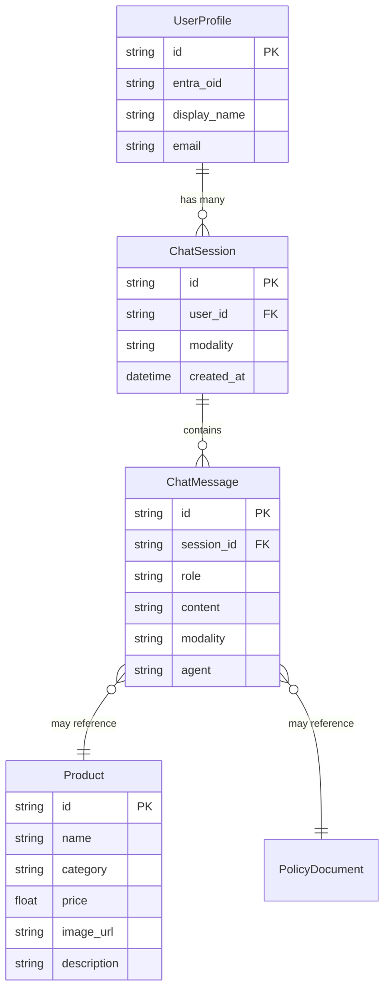

# Design Document: Customer Chatbot GSA with Voice

> **SDL Phase:** 2 (Design)
> **Date:** 2026-03-16
> **Author:** @Sassy → Analyst agent

---

## Overview

Design a unified conversational AI chatbot that supports both text and voice modalities for
product discovery, customer support, and transactional interactions. The solution uses a
multi-agent architecture orchestrated via Azure AI Foundry and Semantic Kernel, with Azure
Voice Live API providing real-time voice input/output capabilities.

## Goals

1. Deliver a unified conversational interface supporting text and voice input/output.
2. Enable multi-agent orchestration (Chat, Product, Policy agents) for domain-specific responses.
3. Integrate Azure Voice Live API for real-time voice transcription and synthesis.
4. Provide responsive web/mobile UI with voice mode toggle and visual product cards.
5. Authenticate users via Microsoft Entra ID and maintain per-user chat history.
6. Comply with SDL, RAI, and GSA quality standards for release to GitHub and Seismic.

## Non-Goals

- Telephony integration (PSTN/SIP) — voice is browser/app-based only.
- Offline voice processing — requires active internet connection.
- Payment/checkout processing — chatbot guides users but does not handle transactions directly.
- Native mobile app — web-only with responsive design for mobile browsers.

> **Note:** Multi-language support (text and voice) is included in v1 scope. The Voice Live API
> language model and GPT-4o system prompts must be configured per-locale. Target languages TBD.

---

## Architecture

### High-Level System Architecture



### Voice Interaction Flow



### Multi-Agent Orchestration Flow



---

## Detailed Design

### Component 1: Agent Orchestrator

**Responsibility:** Routes user messages to the appropriate domain agent based on intent classification, aggregates responses, and manages conversation context.

**Pattern:** GroupChat orchestrator from `python_agent_framework_dev_template` with Semantic Kernel integration.

**Key interfaces:**

```python
# Based on python_agent_framework_dev_template patterns
from semantic_kernel import Kernel
from azure.ai.projects import AIProjectClient

class ChatbotOrchestrator:
    """Routes user messages to domain-specific agents."""

    async def process_message_async(
        self, session_id: str, user_message: str, modality: Literal["text", "voice"]
    ) -> AgentResponse: ...

    async def classify_intent_async(self, message: str) -> Intent: ...
```

**Agent definitions:**

| Agent | Responsibility | Data Sources | Tools |
|---|---|---|---|
| Chat Agent | General conversation, greetings, small talk, fallback | Chat history | Conversation context |
| Product Agent | Product discovery, recommendations, comparisons | Product catalog (Cosmos DB), AI Search | Product search, catalog lookup |
| Policy Agent | Return policy, warranty, FAQ, business info | Policy docs (Blob), AI Search | Document retrieval, policy lookup |

### Component 2: Voice Integration Service

**Responsibility:** Manages bidirectional voice communication via Azure Voice Live API, including WebSocket connections, audio streaming, transcription, and synthesis.

**Pattern:** WebSocket-based streaming with event-driven processing.

**Key interfaces:**

```python
class VoiceService:
    """Manages Azure Voice Live API integration."""

    async def start_session_async(self, session_id: str) -> VoiceSession: ...
    async def process_audio_stream_async(self, audio_chunk: bytes) -> str: ...
    async def synthesize_response_async(self, text: str) -> AudioStream: ...
    async def end_session_async(self, session_id: str) -> None: ...
```

**Voice modes:**
- **Full voice**: Voice input + voice output (default voice mode)
- **Voice-in only**: Voice input + text output (voice output disabled)
- **Text only**: Text input + text output (default)

### Component 3: Chat Session Manager

**Responsibility:** Manages user sessions, persists chat history, and provides conversation context to agents.

**Pattern:** Repository Pattern via `sas-cosmosdb`.

### Component 4: Frontend UI

**Responsibility:** Responsive web interface with voice mode toggle, product card rendering, and real-time chat.

**Pattern:** React-based SPA with WebSocket for voice streaming.

**Key UI elements:**
- Chat panel with message bubbles (text + voice indicators)
- Voice mode toggle button with microphone animation
- Product cards with images, prices, descriptions
- Inline policy/FAQ formatting
- Authentication via MSAL.js (Microsoft Entra ID)

---

## Data Model

### Entities

| Entity | Base Class | Key Type | Container/Table | Store |
|---|---|---|---|---|
| `ChatSession` | `RootEntityBase["ChatSession", str]` | `str` | `chat-sessions` | Cosmos DB |
| `ChatMessage` | `RootEntityBase["ChatMessage", str]` | `str` | `chat-messages` | Cosmos DB |
| `Product` | `RootEntityBase["Product", str]` | `str` | `products` | Cosmos DB |
| `PolicyDocument` | N/A (blob) | `str` | `policies` | Blob Storage |
| `UserProfile` | `RootEntityBase["UserProfile", str]` | `str` | `user-profiles` | Cosmos DB |

### Cosmos DB Entities (via `sas-cosmosdb`)

```python
from sas.cosmosdb.sql import RootEntityBase, RepositoryBase

class ChatSession(RootEntityBase["ChatSession", str]):
    user_id: str
    title: str
    modality: Literal["text", "voice", "mixed"] = "text"
    created_at: datetime
    last_active_at: datetime
    is_active: bool = True

class ChatMessage(RootEntityBase["ChatMessage", str]):
    session_id: str  # partition key
    role: Literal["user", "assistant", "system"]
    content: str
    modality: Literal["text", "voice"]
    agent: str | None = None  # which agent responded
    metadata: dict | None = None  # product cards, links, etc.
    timestamp: datetime

class UserProfile(RootEntityBase["UserProfile", str]):
    display_name: str
    email: str
    entra_oid: str  # Microsoft Entra Object ID
    preferences: dict = {}
    last_login: datetime | None = None

class Product(RootEntityBase["Product", str]):
    name: str
    category: str
    price: float
    description: str
    image_url: str | None = None
    attributes: dict = {}
    is_active: bool = True
```

### Repositories (via `sas-cosmosdb`)

```python
class ChatSessionRepository(RepositoryBase[ChatSession, str]):
    def __init__(self, connection_string: str, database_name: str):
        super().__init__(
            connection_string=connection_string,
            database_name=database_name,
            container_name="chat-sessions"
        )

class ChatMessageRepository(RepositoryBase[ChatMessage, str]):
    def __init__(self, connection_string: str, database_name: str):
        super().__init__(
            connection_string=connection_string,
            database_name=database_name,
            container_name="chat-messages"
        )

class ProductRepository(RepositoryBase[Product, str]):
    def __init__(self, connection_string: str, database_name: str):
        super().__init__(
            connection_string=connection_string,
            database_name=database_name,
            container_name="products"
        )
```

### Blob Storage (via `sas-storage`)

```python
from sas.storage.blob import AsyncStorageBlobHelper

async def get_policy_document(blob_name: str) -> str:
    async with AsyncStorageBlobHelper(account_name="chatbotstore") as helper:
        content = await helper.download_blob("policies", blob_name)
        return content.decode("utf-8")
```

### Relationships



---

## Azure Services

| Service | Library / SDK | Configuration |
|---|---|---|
| Cosmos DB | `sas-cosmosdb` (PyPI) | SQL API, containers: `chat-sessions`, `chat-messages`, `user-profiles`, `products` |
| Blob Storage | `sas-storage` (PyPI) | Containers: `policies`, `product-images` |
| Azure OpenAI | `openai` + Azure endpoint | GPT-4o deployment for all agents |
| Azure AI Foundry | `azure-ai-projects` | Agent hosting, model management |
| Azure AI Search | `azure-search-documents` | Knowledge index over products + policies |
| Azure Voice Live API | Azure Voice Live SDK | Real-time STT/TTS via WebSocket |
| Azure Container Apps | AVM module | Backend API + frontend hosting (containerized) |
| Microsoft Entra ID | `msal` / `azure-identity` | User authentication (OAuth 2.0 / OIDC) |
| Azure Key Vault | `azure-keyvault-secrets` | Secrets management (connection strings, API keys) |

---

## Error Handling & Logging

- Use structured logging via Python `logging` module with correlation IDs per session.
- Voice errors: Graceful fallback to text mode if Voice Live API is unavailable.
- Agent errors: Fallback to Chat Agent if a domain agent fails.
- Authentication errors: Redirect to sign-in with clear error messaging.
- Rate limiting: Queue voice requests and display "processing" state in UI.
- All errors include `session_id` and `user_id` for traceability.

---

## Security Considerations

- [x] **Authentication**: Microsoft Entra ID via MSAL.js (frontend) + bearer token validation (backend).
- [x] **Authorization**: Role-based access; user can only access their own sessions.
- [x] **Data encryption**: TLS 1.2+ in transit; Azure-managed encryption at rest for Cosmos DB and Blob.
- [x] **Secrets management**: All secrets in Azure Key Vault; no secrets in code or config files.
- [x] **Voice data**: Audio streams are transient (not persisted); only transcribed text is stored.
- [x] **Input validation**: All user inputs sanitized before agent processing (prompt injection mitigation).
- [x] **CORS**: Restricted to known frontend origins.
- [x] **Content filtering**: Azure OpenAI built-in content safety filters enabled.

---

## RAI Considerations

### AI Safety for Voice + Generative AI

| Risk | Mitigation |
|---|---|
| **Prompt injection via voice** | Transcribed text passes through same input validation as typed text; system prompts are hardened. |
| **Voice impersonation** | No voice biometric features; authentication is via Entra ID tokens, not voice identity. |
| **Harmful content generation** | Azure OpenAI content safety filters enabled on all deployments; additional post-processing layer. |
| **Bias in product recommendations** | Regular audits of recommendation patterns; diverse test scenarios in QA. |
| **Accessibility** | Voice mode provides alternative for users with limited typing ability; text mode always available. |
| **Privacy — voice recordings** | Audio streams are NOT persisted; only transcribed text stored in chat history. |
| **Consent** | Clear UI indication when microphone is active; explicit user action to enable voice mode. |
| **Hallucination risk** | Agents use RAG (Retrieval-Augmented Generation) over indexed data; responses grounded in source data. |
| **Transparency** | Bot clearly identifies itself as an AI assistant; never claims to be human. |

### RAI Review Checklist

- [ ] Microsoft Responsible AI Standard compliance verified
- [ ] Content safety filters tested with adversarial inputs
- [ ] Voice consent flow designed and reviewed
- [ ] Data retention policy documented (chat history TTL)
- [ ] Accessibility audit completed (WCAG 2.1 AA)
- [ ] Bias testing on product recommendations completed

---

## Testing Approach

| Test Type | Scope | Framework | Target |
|---|---|---|---|
| Unit | Agent logic, intent classification, data models | pytest | 80%+ coverage |
| Unit | Voice service mocking, audio processing | pytest | Voice fallback paths |
| Unit | Frontend components, product cards, voice toggle | Vitest + RTL | UI components |
| Integration | API endpoints, agent orchestration flow | pytest + httpx | End-to-end agent chain |
| Integration | Cosmos DB repository operations | pytest + `sas-cosmosdb` | CRUD operations |
| Integration | Voice API round-trip (STT → Agent → TTS) | pytest | Voice pipeline |
| E2E | Full user journey (sign in → chat → voice → product card) | Playwright | Critical paths |
| RAI | Prompt injection, content safety, bias | Manual + automated | Adversarial inputs |

---

## Dependencies

| Dependency | Version | Source |
|---|---|---|
| `sas-cosmosdb` | latest | Reference catalog — Cosmos DB access |
| `sas-storage` | latest | Reference catalog — Blob/Queue access |
| `semantic-kernel` | latest | Multi-agent orchestration |
| `azure-ai-projects` | latest | Azure AI Foundry integration |
| `azure-search-documents` | latest | Azure AI Search |
| `azure-identity` | latest | Entra ID authentication |
| `azure-keyvault-secrets` | latest | Secrets management |
| `openai` | latest | Azure OpenAI GPT-4o |
| `fastapi` | latest | Backend API framework |
| `msal` | latest | Frontend auth (via MSAL.js for React) |
| Python | 3.12+ | Runtime |
| UV | latest | Package manager |

---

## Risks and Mitigations

| Risk | Likelihood | Impact | Mitigation |
|---|---|---|---|
| Azure Voice Live API availability/maturity | Medium | High | Design voice as an optional layer; text-only mode is fully functional without it. Feature flag for voice. |
| Voice latency affecting UX | Medium | Medium | Streaming responses (chunked TTS); UI shows "listening" and "thinking" states; timeout fallback to text. |
| Multi-agent routing accuracy | Medium | Medium | Extensive intent classification testing; fallback to Chat Agent for ambiguous intents. |
| Cosmos DB partition hot-spots | Low | Medium | Partition `chat-messages` by `session_id`; TTL on old sessions. |
| Prompt injection via voice | Medium | High | Same input sanitization pipeline for voice and text; hardened system prompts; content filters. |
| GTM timeline pressure | Medium | High | Prioritize text-first, voice as incremental feature; milestone-based delivery. |

---

## Open Questions

- [ ] **Q1:** Is Azure Voice Live API GA or in preview? What are the SLA guarantees for production use?
- [ ] **Q2:** Should chat history have a TTL (time-to-live) in Cosmos DB, or should all conversations be retained indefinitely?
- [ ] **Q3:** What is the expected concurrent user load? This affects Cosmos DB RU provisioning and Container Apps scaling.
- [x] **Q4:** ~~Should the Product Agent query SQL Database directly, or should all product data be indexed in Azure AI Search?~~ **Decided:** Consolidate on Cosmos DB for product catalog + AI Search for semantic queries. No SQL Database.
- [x] **Q5:** ~~Is multi-language support planned for v2?~~ **Decided:** Multi-language support included in v1. Target languages TBD.
- [x] **Q6:** ~~Should the frontend be a standalone React SPA or embedded within the existing Customer Feedback web app?~~ **Decided:** Standalone React SPA. Customer Feedback web app is deprecated.
- [x] **Q7:** ~~Is there an existing product catalog database/schema, or does it need to be designed from scratch?~~ **Decided:** Design from scratch in Cosmos DB (`products` container via `sas-cosmosdb`).
- [x] **Q8:** ~~What compliance requirements apply (GDPR, SOC 2, HIPAA)?~~ **Decided:** No specific compliance frameworks required at this time. Will revisit if needed.
- [x] **Q9:** ~~Should voice transcripts be stored separately from text messages for audit/compliance purposes?~~ **Decided:** Same `chat-messages` container. Voice transcripts are just text (~1 KB each). Distinguished by `modality` field.
- [x] **Q10:** ~~Will Azure Container Apps be used instead of App Service for microservice-oriented deployment?~~ **Decided:** Azure Container Apps for all hosting.
