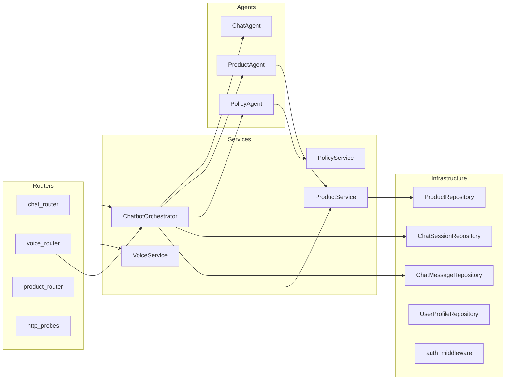

# Customer Chatbot API

Multi-agent conversational AI backend with voice integration for the Customer Chatbot GSA.

## Architecture



- **FastAPI** — HTTP/WebSocket API gateway
- **Semantic Kernel + Azure AI Foundry** — Multi-agent orchestration (Chat, Product, Policy agents)
- **Azure Voice Live API** — Real-time speech-to-text and text-to-speech via WebSocket
- **Cosmos DB** (via `sas-cosmosdb`) — Chat sessions, messages, user profiles, product catalog
- **Blob Storage** (via `sas-storage`) — Policy documents, product images
- **Azure AI Search** — RAG over products and policies
- **Microsoft Entra ID** — Bearer token authentication

## Quick Start

```bash
# Install dependencies
uv sync

# Install dev dependencies
uv sync --group dev

# Copy environment config
cp .env.example .env
# Edit .env with your Azure resource values

# Run locally
uv run uvicorn app.main:app --reload --port 8000

# Run tests (63 tests)
uv run pytest

# Run with coverage
uv run pytest --cov=app --cov-report=term-missing
```

## Project Structure

```
app/
├── main.py                    # FastAPI entry point + lifespan (DI wiring)
├── application.py             # Settings via pydantic-settings
├── agents/                    # AI agent definitions
│   ├── chat_agent.py          # General conversation (fallback)
│   ├── product_agent.py       # Product discovery + recommendations
│   └── policy_agent.py        # Returns, warranty, FAQ
├── domain/                    # Domain layer
│   ├── entities.py            # Cosmos DB entities (sas-cosmosdb RootEntityBase)
│   ├── enums.py               # Intent, Modality, VoiceMode, MessageRole
│   └── models.py              # Pydantic request/response models
├── infrastructure/            # Data access layer
│   ├── repositories.py        # ChatSession, ChatMessage, Product, UserProfile repos
│   └── auth_middleware.py     # Entra ID JWKS token validation
├── services/                  # Business logic
│   ├── chatbot_orchestrator.py # Intent classification + agent routing
│   ├── voice_service.py       # Azure Voice Live API (STT/TTS)
│   ├── product_service.py     # Product catalog + AI Search
│   └── policy_service.py      # Policy docs (Blob) + AI Search
└── routers/                   # API route handlers
    ├── chat_router.py         # POST /message, POST /session, GET /history, DELETE /session
    ├── voice_router.py        # WS /stream
    ├── product_router.py      # GET /{product_id}
    └── http_probes.py         # GET /api/health, GET /api/ready
tests/
├── unit/                      # Unit tests (test_agents, test_orchestrator, test_models, etc.)
└── integration/               # Integration tests (test_http_probes)
```

## API Endpoints

| Method   | Path                                | Description              | Auth         |
| -------- | ----------------------------------- | ------------------------ | ------------ |
| `POST`   | `/api/chat/message`                 | Send text message        | Bearer token |
| `POST`   | `/api/chat/session`                 | Create chat session      | Bearer token |
| `GET`    | `/api/chat/session/{id}/history`    | Get chat history         | Bearer token |
| `DELETE` | `/api/chat/session/{id}`            | End/archive session      | Bearer token |
| `WS`     | `/api/voice/stream`                 | Voice audio streaming    | Token in msg |
| `GET`    | `/api/products/{id}`                | Get product details      | None         |
| `GET`    | `/api/health`                       | Liveness probe           | None         |
| `GET`    | `/api/ready`                        | Readiness probe          | None         |

See [docs/api/chatbot-api.md](/docs/api/chatbot-api.md) for full API documentation.

## Configuration

Settings are loaded from environment variables via `pydantic-settings`. Key variables:

| Variable                             | Description                        | Default              |
| ------------------------------------ | ---------------------------------- | -------------------- |
| `COSMOS_CONNECTION_STRING`           | Cosmos DB connection string        |                      |
| `COSMOS_DATABASE_NAME`               | Cosmos DB database name            | `customer-chatbot`   |
| `AZURE_OPENAI_ENDPOINT`             | Azure OpenAI endpoint URL          |                      |
| `AZURE_OPENAI_DEPLOYMENT`           | GPT-4o deployment name             | `gpt-4o`             |
| `AZURE_SEARCH_ENDPOINT`             | Azure AI Search endpoint           |                      |
| `AZURE_STORAGE_ACCOUNT_NAME`        | Storage account for policy docs    |                      |
| `AZURE_VOICE_KEY`                   | Azure Voice Live API key           |                      |
| `AZURE_VOICE_REGION`                | Azure Voice region                 | `eastus2`            |
| `AZURE_TENANT_ID`                   | Microsoft Entra tenant ID          |                      |
| `AZURE_CLIENT_ID`                   | App registration client ID         |                      |
| `ALLOWED_ORIGINS`                   | CORS allowed origins               | `http://localhost:5173` |

## Dependencies

Key dependencies from `pyproject.toml`:

| Package                       | Purpose                              |
| ----------------------------- | ------------------------------------ |
| `fastapi`                     | API framework                        |
| `sas-cosmosdb`                | Cosmos DB Repository Pattern         |
| `sas-storage`                 | Azure Blob Storage operations        |
| `semantic-kernel`             | Multi-agent orchestration            |
| `azure-ai-projects`           | Azure AI Foundry integration         |
| `azure-search-documents`      | Azure AI Search queries              |
| `openai`                      | Azure OpenAI GPT-4o                  |
| `azure-cognitiveservices-speech` | Azure Voice Live API (STT/TTS)    |
| `pyjwt[crypto]`              | Entra ID token validation            |
| `azure-identity`              | Azure credential management          |
