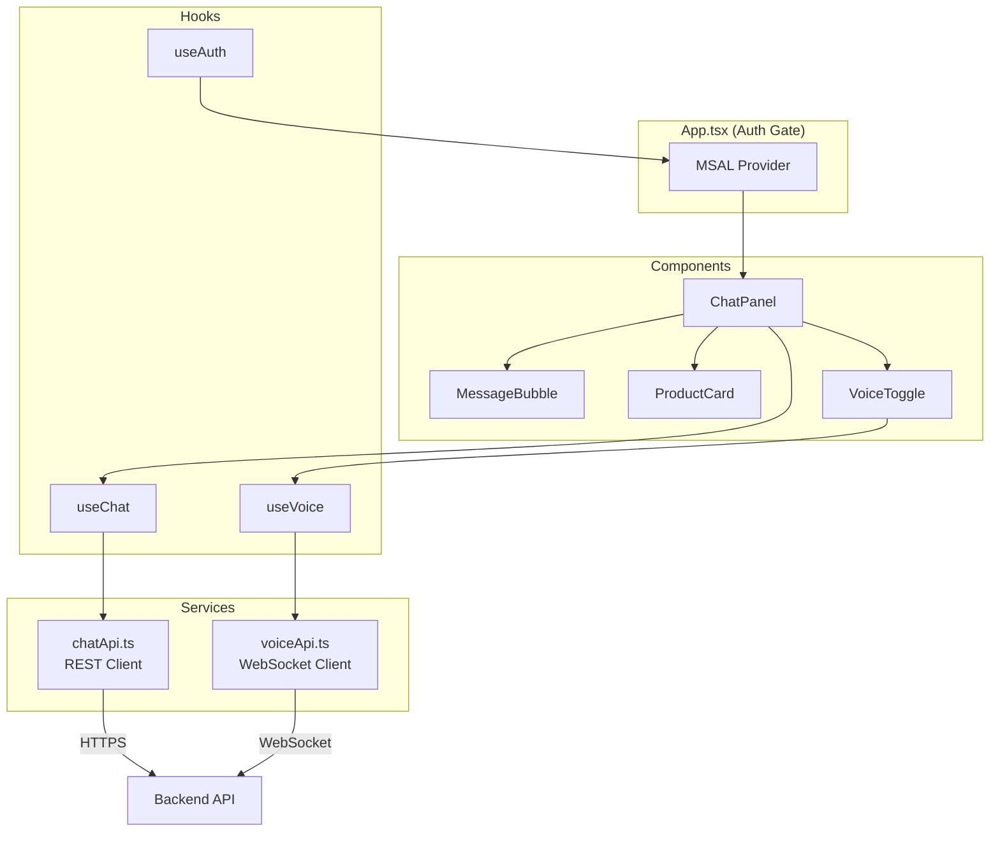

# Customer Chatbot Web

React-based SPA frontend for the Customer Chatbot GSA with voice integration.

## Architecture



## Features

- **Text and voice chat** — Unified conversational interface with MSAL.js authentication
- **Voice mode toggle** — Real-time audio streaming via WebSocket to Azure Voice Live API
- **Product cards** — Visual product cards rendered from agent responses
- **Message bubbles** — Differentiated display for user, assistant, and voice messages
- **Responsive design** — Web and mobile browser support

## Quick Start

```bash
# Install dependencies
npm install

# Copy environment config
cp .env .env.local
# Edit .env.local with your Azure AD app registration values

# Run dev server (proxies /api to localhost:8000)
npm run dev

# Run tests (31 tests)
npm test

# Run with coverage
npm run test:coverage

# Build for production
npm run build

# Lint
npm run lint
```

## Project Structure

```
src/
├── main.tsx                # Entry point with MSAL provider
├── App.tsx                 # Root component with auth gate
├── Components/
│   ├── ChatPanel.tsx       # Main chat UI (message list, input, send)
│   ├── ChatPanel.test.tsx  # ChatPanel tests
│   ├── MessageBubble.tsx   # Individual message display (text/voice indicator)
│   ├── MessageBubble.test.tsx
│   ├── ProductCard.tsx     # Product card from agent responses (name, price, image)
│   ├── ProductCard.test.tsx
│   ├── VoiceToggle.tsx     # Voice mode toggle button with mic animation
│   └── VoiceToggle.test.tsx
├── Hooks/
│   ├── useAuth.ts          # MSAL authentication hook (login, logout, token)
│   ├── useChat.ts          # Chat session & messaging hook (create, send, history)
│   └── useVoice.ts         # Voice streaming hook (start, stop, audio processing)
├── Services/
│   ├── chatApi.ts          # REST API client for chat endpoints
│   └── voiceApi.ts         # WebSocket client for voice streaming
├── msal-auth/
│   └── authConfig.ts       # MSAL configuration (client ID, tenant, scopes)
└── types/
    └── index.ts            # Shared TypeScript types (ChatMessage, Product, etc.)
tests/
└── setup.ts                # Vitest + jsdom setup
```

## Environment Variables

| Variable               | Description                                     |
| ---------------------- | ----------------------------------------------- |
| `VITE_AZURE_CLIENT_ID` | Azure AD app registration client ID             |
| `VITE_AZURE_TENANT_ID` | Azure AD tenant ID                              |
| `VITE_API_BASE_URL`    | Backend API base URL (optional, for production) |

## Tech Stack

| Layer     | Technology                                            |
| --------- | ----------------------------------------------------- |
| Framework | React 18                                              |
| Language  | TypeScript 5.6                                        |
| Build     | Vite 6                                                |
| Auth      | MSAL.js (`@azure/msal-browser` + `@azure/msal-react`) |
| Testing   | Vitest + React Testing Library + jsdom                |
| Linting   | ESLint 9 + Prettier                                   |
